# Personal Health Fitness Tracker

This is a Python mini project made using Python and MySQL. It is a simple console based (command line) application where a user can register, login and keep track of their daily health details like weight, steps, water intake and sleep. It also shows BMI, calories required and fitness category automatically. There is also an Admin panel to manage all the users.

This project was made as a college project for BCA.

## Team Members

- Niharika Karkra (Team Lead)
- Gorank (Team Member)

Mentor: Ms. Ankita
College: SVIET

## Features

- Register and Login
- User can view and update their profile
- User can add and update today's health record (weight, steps, water, sleep)
- App automatically calculates:
  - BMI and BMI Category
  - Calories Required
  - Ideal Water Intake
  - Fitness Category
- User can view their health history with highest, lowest and average
- Admin can view all users
- Admin can search user (by id, username, name)
- Admin can delete a user
- Admin can view daily records of all users

## Technology Used

- Python 3
- MySQL
- mysql-connector-python library

## Project Files

```
main.py            -> starting point of the project, shows main menu
auth.py             -> login and register code
user.py              -> user panel (profile, add record, history)
admin.py              -> admin panel (view/search/delete users)
calculations.py        -> BMI, calories, water, fitness calculations
reports.py               -> shows the health summary and analysis
database.py                -> connects to MySQL and runs queries
config.py                   -> database username password etc
requirements.txt              -> required python library
test_connection.py             -> file to test database connection
screenshots/                     -> screenshots of the project
```

## How to Run this Project

1. Install MySQL and create a database

```sql
CREATE DATABASE health_tracker;
USE health_tracker;

CREATE TABLE users (
    user_id INT AUTO_INCREMENT PRIMARY KEY,
    name VARCHAR(100),
    username VARCHAR(50) UNIQUE,
    password VARCHAR(255),
    role ENUM('admin','user') DEFAULT 'user',
    age INT,
    gender ENUM('Male','Female'),
    height FLOAT
);

CREATE TABLE daily_records (
    record_id INT AUTO_INCREMENT PRIMARY KEY,
    user_id INT,
    record_date DATE,
    weight FLOAT,
    steps INT,
    water FLOAT,
    sleep FLOAT,
    FOREIGN KEY (user_id) REFERENCES users(user_id)
);
```

2. Install the required library

```
pip install -r requirements.txt
```

3. Open `config.py` and add your own MySQL username and password

```python
DB_CONFIG = {
    "host": "localhost",
    "user": "your_username",
    "password": "your_password",
    "database": "health_tracker"
}
```

4. Run the project

```
python3 main.py
```

## Screenshots

(Put all the screenshots inside a folder named `screenshots` in the project, with the same file names, so these images show up properly)

Main Menu
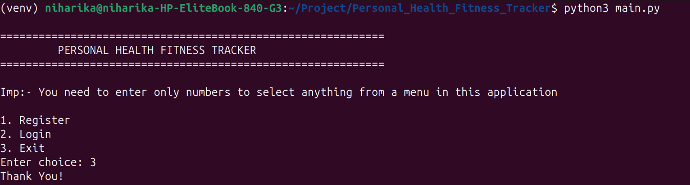

Register
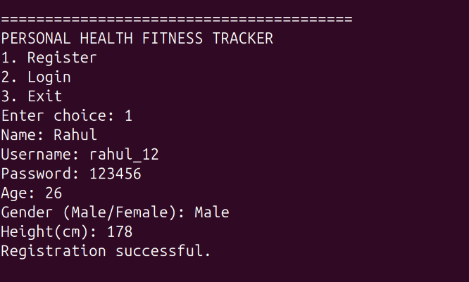

Login and User Panel
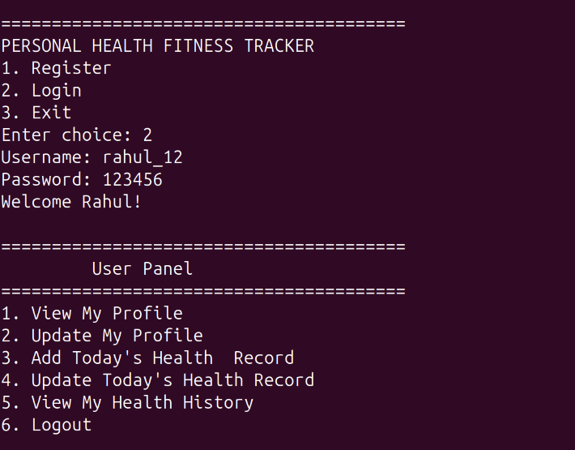

View Profile
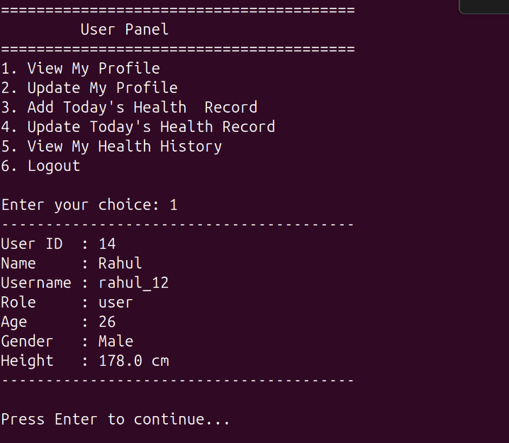

Record Already Added (Analysis Shown)
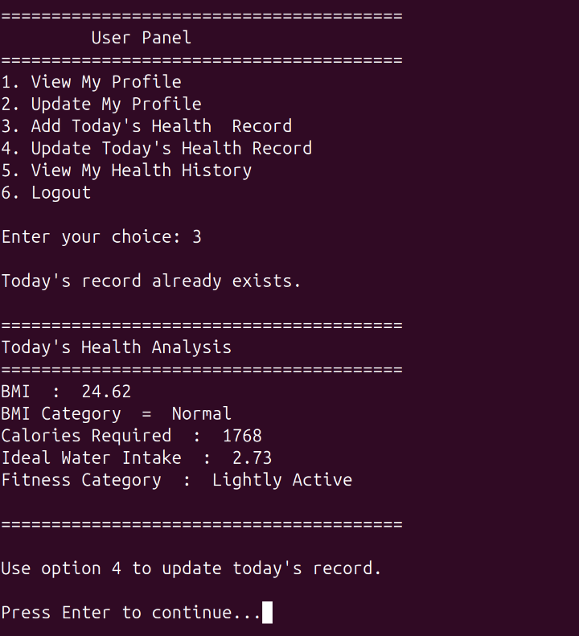

Add Health Record
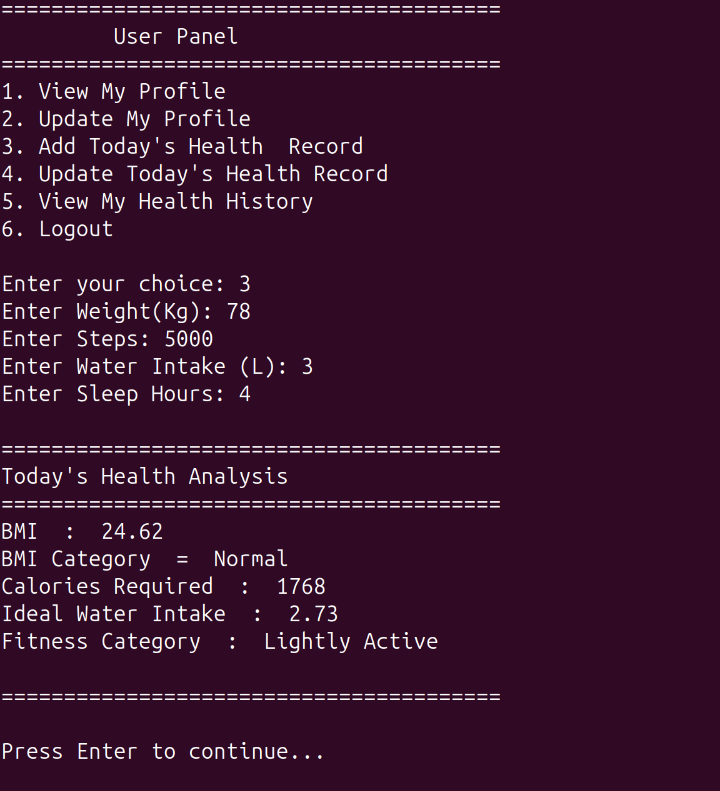

View Health History and Summary
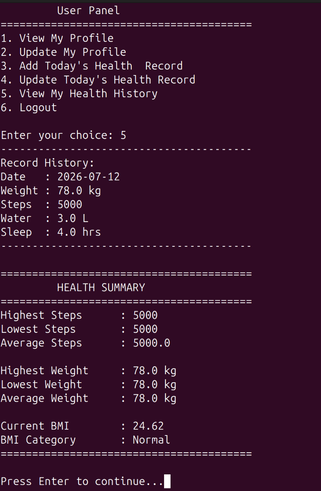

Update Profile
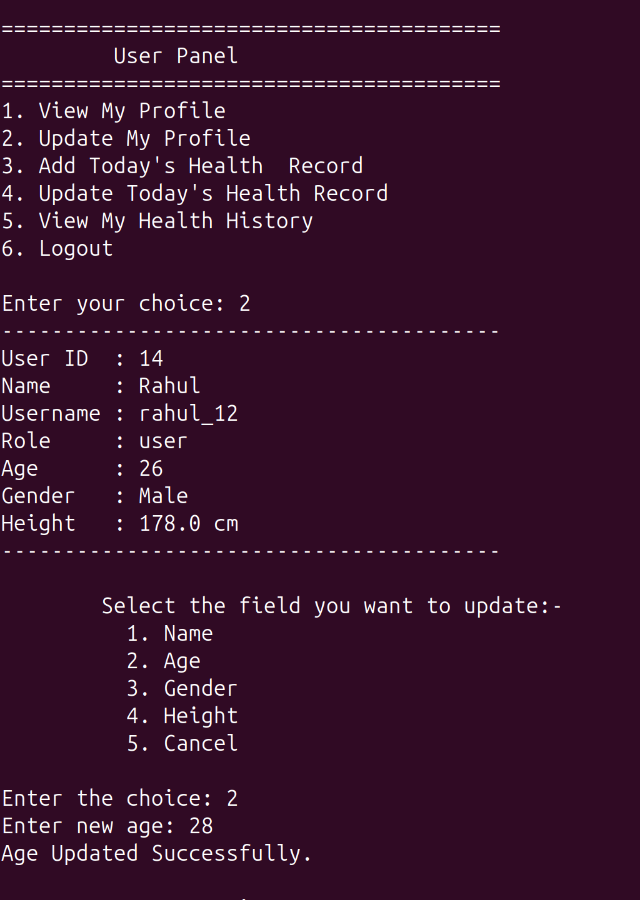

Profile After Update
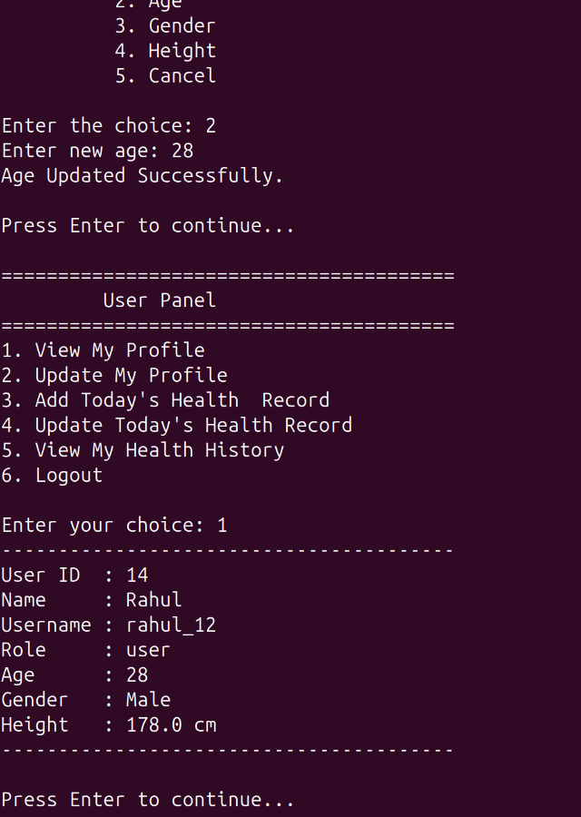

Admin Login and View All Users
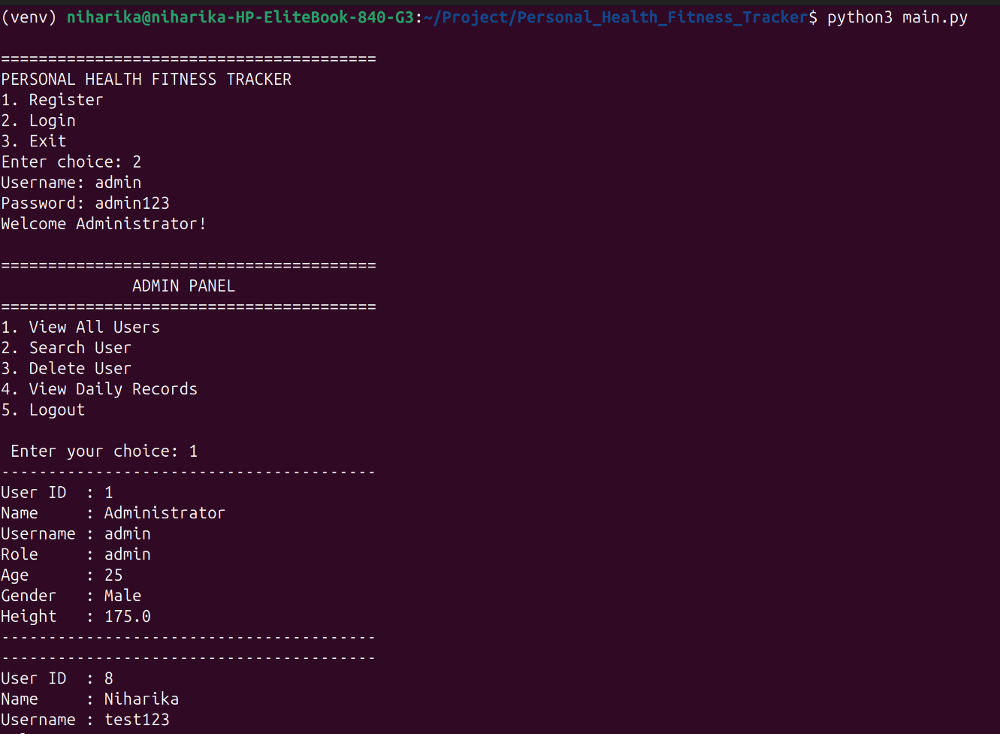

View All Users (continued)
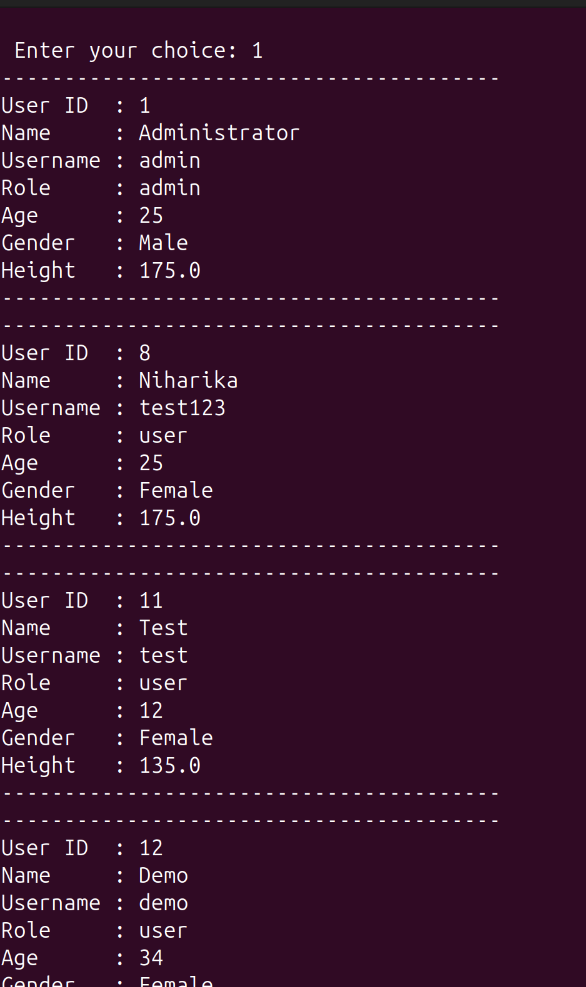

Search User
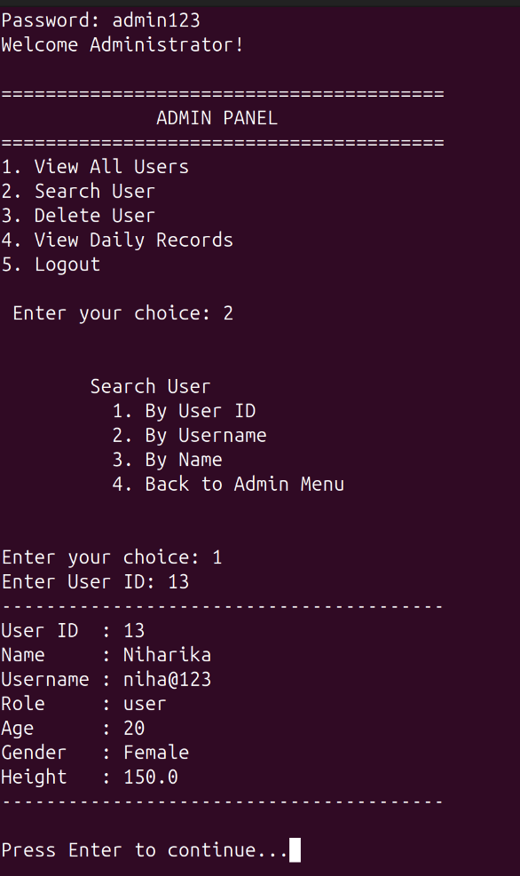

Delete User
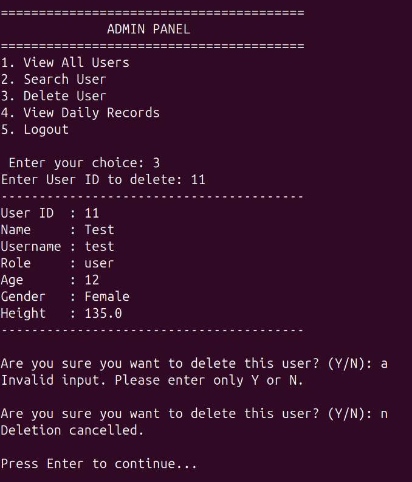

View Daily Records
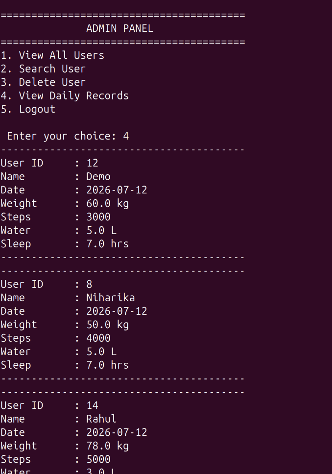

Exit


## Future Improvements

- Make a GUI or web version
- Store password in encrypted form
- Add graphs for tracking progress
- Add option to export report as PDF

## Note

This project was made for learning purpose as a part of our BCA project.
